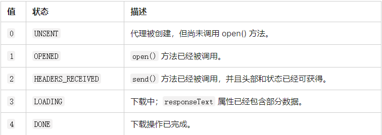

# 浅析AJAX原理
## 什么是AJAX
AJAX 是异步的 JavaScript 和 XML（Asynchronous JavaScript And XML）。简单点说就是使用XMLHttpRequest对象与服务器通信。它可以使用 JSON，XML，HTML 和 text 文本等格式发送和接收数据。可以做到在不重新刷新页面的情况下与服务器通信，交换数据或更新页面。  
可以使用AJAX最主要的两个特性来做下列事情：  
* 在不重新加载页面的情况下发送请求给服务器。
* 接受并使用从服务器发来的数据。

### 怎样发送http请求？
必须先创建一个XMLHttpRequest对象
```javascript
const request = new XMLHttpRequest()
```
再通过request.open()来初始化一个请求：  
```javascript
const request = new XMLHttpRequest()
request.open('GET','url')
```
这里open接受三个参数，第一个是方法，第二个是url，第三个是布尔。  
方法就是请求数据的方式如：'GET','POST'；url指的是你想要的传输的url，这个值与服务器中的值是相对应的。第三个是布尔值，true是开启异步，false是关闭异步，默认值是开启的。  

之后先补上send发送请求，以防最后忘记  
```javascript
const request = new XMLHttpRequest()
request.open('GET','url')
request.send()  //如果之前是'POST'请求的话，那么send后面的括号需要加入想发给服务器的内容
```
### 处理服务器响应
处理服务器响应我们常常要用到多个函数值判断来配合使用：  
```javascript
request.onreadystatechange=()=>{
if(request.readyState===4&&request.status===200){
    request.onload=()=>{
            //DOM操作
    }
    request.send()
}
```
这里一开始要执行onreadystatechange函数，该函数在readyState状态值改变的时候会执行。  
那么什么是readyState状态值？  
该是指是代表XMLHttpRequest当前状态的数字，有0~4五个数字表示，每个数字有不一样的含义，如下图所示：  
  

当onreadystatechange函数执行后，会再次判断readyState的值是否等于4，也就是是否下载操作已经完成，同时还会判断status（状态码）是否等于200，如果同时满足就会执行onload函数(*成功请求完成后触发该函数*)来执行DOM操作，或者是其他操作。这样就可以保证在状态码和状态值都是正常的情况下进行数据的传输。
### 总结说明
我们常常把AJAX绑定在一个按钮的点击事件上，点击后就可以访问数据，总结上面的方法后，再加上点击事件，假如按钮的id='getPage'，那么全程是这样的：  
```javascript
getPage.onclick=()=>{
    const request=new XMLHttpRequest()
    request.open('GET',`url`)
    request.onreadystatechange=()=>{
    if(request.readyState===4&&request.status===200){
        request.onload=()=>{
            //DOM操作
        }
    }
    request.send()
    }
}
```
流程说明：  
用AJAX来请求数据一共会经历五个步骤：   
1. 创建异步对象：也就是new一个XMLHttpRequest对象
2. 设置请求方式和url：也就是request.open(此时readyState===1)
3. 用send来发送请求(此时readyState===2)
4. 用各种函数来监听请求的状态变化
5. 最后接受返回的数据并进行处理   


## 请求各种类文件的思路
对于AJAX来说，处理各种类文件的思路都大庭相径，无非是在响应中加入DOM操作
### 请求html/css/js
由于其他部分都与上文总结的部分相同，就不再赘述，以下代码默认都是放在上文总结代码的注释区域，也就是注释DOM操作的位置。  
假如html文件中：  
```javascript
const div=document.createElement('div')  //创建一个div标签 
    div.innerHTML=request.response  //将div标签中的内容变成响应的内容
    document.body.appendChild(div)  //将div标签放入body中
```
这里request.response会返回一个响应的正文，可能是字符串可能是其他东西，这个取决于请求的responseType属性，如果用node.js该设置会在自己的服务器文件中设置到。  
同理css和js文件的引用思路如下：  
```javascript
//CSS
 const style=document.createElement('style')
       style.innerHTML=request.response
       document.head.appendChild(style)

//JS
const script=document.createElement('script')
    script.innerHTML=request.response
    document.body.appendChild(script)
```  
### 请求XML文件
```javascript
const dom=request.responseXML  //这里会直接返回一个dom对象
const text=dom.getElementsByTagName('warning')[0].textContent
      console.log(text.trim())  //这里使用trim可以打印出不带空格的内容
```
### 请求JSON文件
```javascript
const object=JSON.parse(request.response)  //JSON.parse可以把JSON变成符合JS语法的对象或者是其他东西
  //剩下的想干嘛就干嘛
```   

# server的配置文件（本人自用，可以忽略）
```javascript
if(path === '/main.js'){
    response.statusCode = 200
    response.setHeader('Content-Type', 'text/javascript;charset=utf-8')
    response.write(fs.readFileSync('public/main.js'))
    response.end()
  } else if(path==='/style.css'){
    response.statusCode = 200
    response.setHeader('Content-Type', 'text/css;charset=utf-8')
    response.write(fs.readFileSync('public/style.css'))
    response.end()
  }else if(path==='/2.js'){
    response.statusCode = 200
    response.setHeader('Content-Type', 'text/javascript;charset=utf-8')
    response.write(fs.readFileSync('public/2.js'))
    response.end()
  }else if(path==='/3.html'){
    response.statusCode = 200
    response.setHeader('Content-Type', 'text/html;charset=utf-8')
    response.write(fs.readFileSync('public/3.html'))
    response.end()
  }else if(path==='/4.xml'){
    response.statusCode = 200
    response.setHeader('Content-Type', 'text/xml;charset=utf-8')
    response.write(fs.readFileSync('public/4.xml'))
    response.end()
  }else if(path==='/5.json'){
    response.statusCode = 200
    response.setHeader('Content-Type', 'text/json;charset=utf-8')
    response.write(fs.readFileSync('public/5.json'))
    response.end()
  }
```