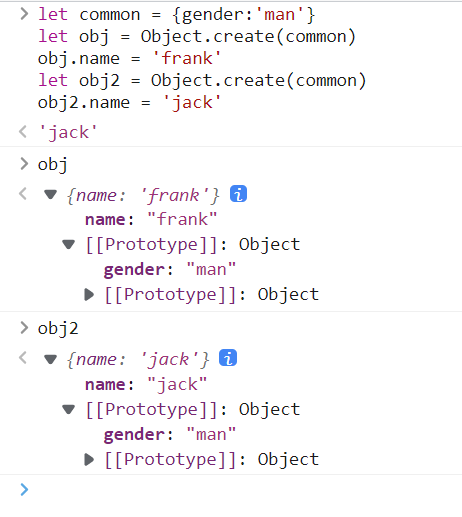

# JS对象基本用法
本文的主要内容有：
1. 声明对象的两种语法
2. 如何删除对象的属性
3. 如何查看对象的属性
4. 如何修改或增加对象的属性
5. 'name' in obj和obj.hasOwnProperty('name')的区别  

## 前言
要了解JS中的对象（Object），必须先要确定一下什么是JS中的对象，对象是JS中七种数据类型中唯一的一种复杂数据类型，它有着自己的定义：  
* 无序的数据集合
* 键值对的集合  

什么是键，什么是值？以下面的代码为例：
```javascript
let obj = {'name':'frank','age':18}
```
其中，name和age就是这个obj对象中的键（key），而name和age所对应的frank和18，就是它的值，这样一个个无序的键和值一一对应组成的数据集合，就是对象。  
### 属性名
每一个对象中的key都是对象的属性名，所有的属性名会自动变成字符串。你可以使用`Object.keys(obj)`来查看obj中所有的key。如：  

   

还可以用变量当属性名：
```javascript
let p1 = 'name'
let obj = {p1:'frank'}//这样写，属性名为p1
let boj = {[p1]:'frank'}//这样写，属性名为name
```
也就是说：
* 不加[]的属性名会自动变成字符串
* 加了[]的属性名会当做变量求值
* 值如果不是字符串，则会自动变成字符串  

了解完这些后，下面开始进入正题
## 声明对象的两种语法
```javascript
1. let obj = {'name':'frank','age':18}
2. let obj = new Object({'name':'frank','age':18})
3. console.log({'name':'frank','age':18})
```
上面是声明对象的三种写法，但是1和2可以看做是一种，2是1的标准写法，但是推荐使用1，因为方便哇！  
还需要注意一些细节：
* 键名是字符串，不是标识符，可以包含任意字符
* 引号可以省略，省略之后就只能写标识符
* 就算引号省略了，键名也还是字符串
## 如何删除对象的属性
有两种删除对象属性的方法
```javascript
delete obj.key
delete obj['key']
```
这里删除的不仅是它的属性名，还有它的属性值。如何判断它已经成功删除了呢？
使用：
```javascript
'key' in obj //查看返回值
//如果是false，那说明删除成功了，true说明该属性还在对象中
```
还有一种情况是，对象中有属性名，但是属性值为undefined，这该用什么判断？
```javascript
'key' in obj && obj.key //查看其返回值，若返回值为undefined
                    //则说明该属性值在obj内，且值为undefined
```
但是不能单用`obj.key === undefined`来断定该值在obj内。
## 如何查看对象的属性
分别有：  
```javascript
1. Object.keys(key) //查看对象的所有属性名
2. Object.values(key) //查看对象的值
3. Object.entries(key) //查看对象中的值和属性名
```  

    

如何查看对象中的共有属性，有两种：  
```javascript
1. console.dir(key) //把共有属性以目录的形式打出
2. key.__proto__    //不推荐，因为不同浏览器中的__proto__名字不一定相同
```
如何判断这个属性是否在对象里，且为非共有属性？
```javascript
obj.hasOwnProperty('key') //查看其返回值
//true为属性在对象里，且为非共有属性；false为属性不在对象里，或为共有属性 
```
还有三种查看属性值的方法：
```javascript
1. obj.['key']
2. obj.key  //此时key为字符串，查看的是字符串key的值
3. obj[key] //此时key为变量，查看的是变量key的值
```
其中，优先使用第一种方法，因为2和3的方法有坑，看注释，新手比较容易出错。  
也就是说 ：  
**obj.key等价于obj.['key']**  
**obj.key不等价于obj[key]**
## 如何修改或增加对象的属性
### 直接赋值
以下的方法都可以用
```javascript
let obj = {name:'frank'}
obj.name = 'frank'
obj['name'] = 'frank' //此处不能用obj[name],因为name是变量，值 不确定
obj['na'+'me'] = 'frank'
let key = 'name' ; obj[key] =  'frank'//此处不能用obj['key']
```
批量赋值:`Object.assign(obj,{age:18,gender:'man'})`  
### 修改或增加共有属性
一般来说，不能通过自身修改或增加共有属性，如图所示，我们修改了obj的toString，但obj2的toString并不受影响：    

    

但是如果偏要修改或增加原型，可以通过：
```javascript
1. obj.__proto__.toString='xxx' //不推荐使用，因为每个浏览器的__proto__可能不同
2. Object.prototype.toString='xxx'
```
  
   

但是一般情况下，不要去修改原型，会引起很多问题  
如何修改隐藏属性__proto__，有两种方法
第一种：  
```javascript
let obj = {name:'frank'}
let obj2 = {name:'jack'}
let common = {kind:'human'}
obj.__proto__ = common
obj2.__proto__ = common  //不推荐，因为__proto__名不一定都相同
```
完成后就会多一个obj和obj2共有的属性：  

   

推荐使用第二种：  
```javascript
let common = {}
let obj = Object.create(common)
obj.name = 'frank'
let obj2 = Object.create(common)
obj2.name = 'jack'
```
效果都是一样的  

  

## 'name' in obj和obj.hasOwnProperty('name')的区别
这个上文有说过，这里再次说明一下，两个都是用来判断name是否在obj中的语句，但是，'name' in obj中name的判断范围包括了obj所包含的所有的共有属性，也就是说，如果obj中的共有属性有name，那'name' in obj的判断结果就为true；但是obj.hasOwnProperty('name')就只会判断obj这个对象独有的属性，不会包括任何共有属性中的内容。  
放张图就明白了！  

    

图中是上文加入了新的共有属性gender的obj对象，用'gender' in obj来判断，结果为true，用obj.hasOwnProperty('gender')来判断结果为false，可以很明显的看出二者的区别。