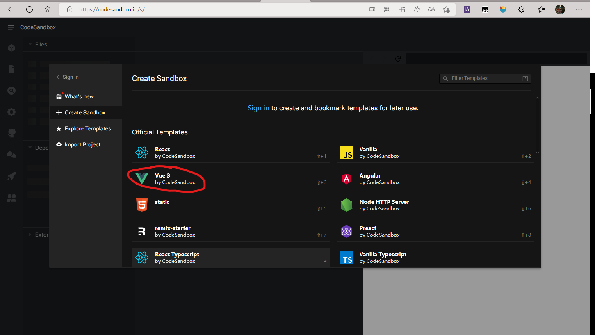
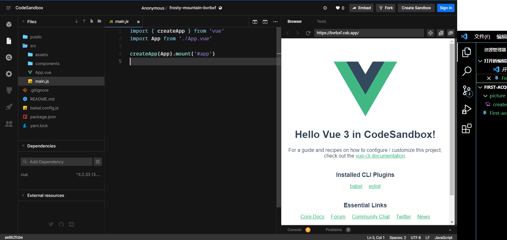
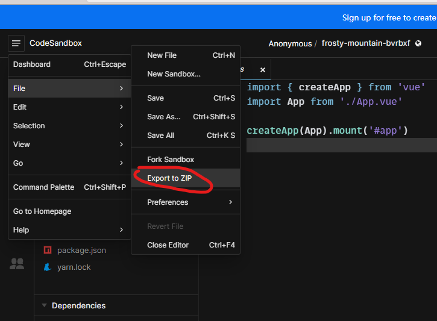

# 初识Vue
## Vue不同版本的区别
在Vue.js的官网中可以看到Vue有两个不同的版本，称为完整版和非完整版，两个版本的有所区别。各有各的用途所在：  
两个版本在cdn中引入的名字分别为：  
* vue.js (完整版)
* vue.runtime.js (非完整版)
* 如果要引用生产环境的版本，则都需要在.js前加一个.min  

两者的区别在于：  
* 完整版有compiler (编译器)，而非完整版没有，这也导致了完整版的代码体积会比非完整版的体积大40%
* 完整版的视图部分写在HTML里或者写在template选项里，而非完整版主要写在render函数里用h来创建标签
* 从webpack引入和@vue/cli引入默认是非完整版，而需要用完整版则需要进行额外的配置  

那么该使用完整版还是非完整版呢？   
这里有一个建议：总是使用非完整版，然后配合vue-loader和vue文件使用  
这样可以：  
1. 保证用户体验，用户下载的JS文件体积更小，但只支持h函数
2. 保证开发体验，开发者可直接在vue文件里写HTML标签，而不写h函数
3. 脏活可以让loader做，vue-loader把vue文件里的HTML转为h函数

## template与render的用法
template是一个字符串模板，可以将网页的主体部分放进vue文档中的template标签里，写入template中的内容可以用render渲染后出现在视图中。
```JavaScript
<template>
  <div class="red">
    {{n}}     
    <button @click="add">+1</button>
  </div>
</template>

//这就会在HTML中显示一个+1的button，和{{n}}替换出的东西。
```    

render是用于渲染页面的函数，它接受一个函数，然后在函数中调用这个函数，就可以渲染vue中的文件至HTML中了。
```JavaScript
import Demo from "./Demo";  //引入./Demo.vue文件
new Vue({
  el:'#app',
  render(h){
    return h(Demo)  //执行函数，渲染视图
  }
})
```  

## 使用codesandbox.io来写代码
首先需要登入`https://codesandbox.io/`这个网站,然后点右上角`Create Sandbox`创建自己的沙盒。
   
点击vue3来创建自己的vue项目
  
就可以在这个页面开发Vue项目，并且右边还有项目的实时预览。   
项目完成后就可以点击这里，导出ZIP文件保存到本地了。
