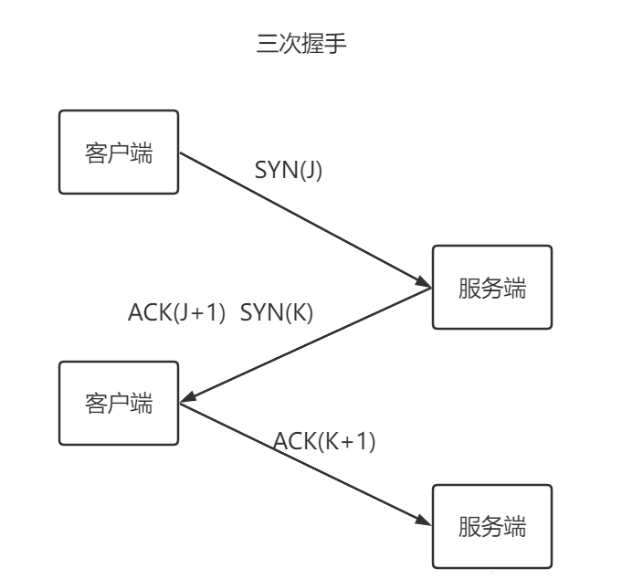
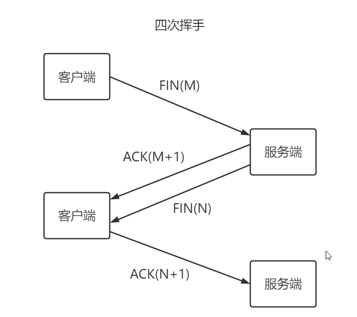

传输控制协议（**TCP**，Transmission Control Protocol）是为了在不可靠的互联网络上提供可靠的端到端字节流而专门设计的一个传输协议，此协议用于两个通信点点对点之间进行连接，具有可靠性。  
在开始正式传输数据之前，首先客户端要和服务端之间进行通信，就叫做所谓的三次握手。
# TCP的三次握手
  
## 三次握手流程
1. 第一步，客户端的TCP向服务端的TCP发送一个特殊的TCP报文段，这个特殊的报文段被称为**SYN报文段**，并且客户端还会随机选择一个**初始序号（J）**和这个报文段一起发给服务端，此时客户端进入**SYN-SENT状态**。  
2. 第二歩，服务端收到SYN报文段，并向客户端发送允许连接的**报文段ACK(J+1)**，同时也会发一个SYN报文段包含着一个** 随机序号（K）**，与确认字段ACK一同发送给客户端，此报文段被称为**SYNACK报文段**，此时服务器进入**SYN-RECEIVED状态**。  
3. 第三步，客户端接收到SYNACK报文段，此时**客户端进入ESTABLISHED状态**，客户端向服务器发送另外一个报文段，这个报文段是对副武器的允许连接的报文段的**确认ACK(K+1)**，在服务端收到后，也**进入ESTABISHED状态**。之后就可以进行数据传输了。    

注意：前两次握手是不能携带数据的，第三次握手的时候是可以携带数据的。
## 每次握手的目的
1. 第一次握手是为了确认客户端的发送能力和服务器的接收能力没有问题
2. 第二次握手是为了确认服务端的发送能力和接收能力没有问题
3. 第三次握手是为了确认客户端的接收能力和发送能力没有问题
## 为什么不能是两次握手
第三次握手是为了确定客户端的接收能力是没有问题的，也可以防止已失效的连接请求报文突然有传递给服务端，造成双方的不一致，导致资源浪费。
# TCP的四次挥手
  
## 挥手流程
1. 第一次挥手，客户端**发送FIN包**，包里有客户端的**序列号M**
2. 第二次挥手，服务端收到了客户端发送的FIN包后，向客户端发送**响应报文ACK**，并将**序列号值M+1**一同传递给客户端。
3. 第三次挥手，服务端由于接收到了关闭传输的请求，于是向客户端**发送FIN**，包含了**序列号N**，表示客户端将要关闭传输了
4. 第四次挥手，服务端接收到了响应报文和关闭请求FIN(N)，于是再次发送了一个确认关闭的响应报文**ACK(N+1)**，至此，完成了客户端的四次挥手

## 为什么是四次挥手，二三次挥手能合为一次吗
1. 因为TCP连接是全双工通信的（二者可以发送和接受数据）  
2. 当客户端发送FIN报文之后，就意味着客户端不在发送数据报文了，但客户端任然可以接受数据报文，且此时服务器可能还有数据报文需要发送，所以只能先回复一个ACK报文，告诉客户端。当服务器数据发送完成，服务器也发送一个FIN报文，这样就可以保证数据的通信可以正常完成，因此不能把二三次挥手合为一次。