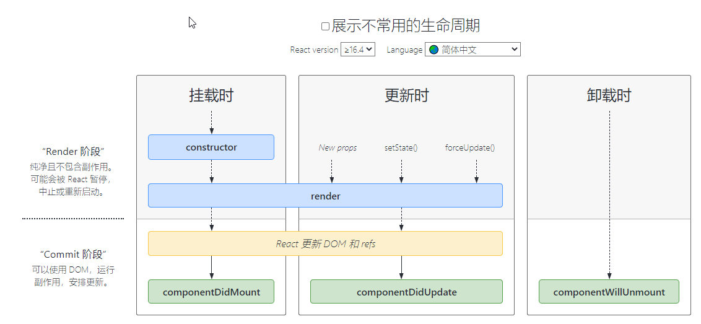
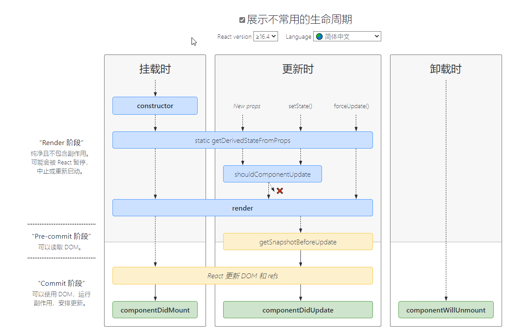

在React中也有生命周期的概念，但是React的生命周期只存在于Class声明的组件中，在Hooks组件是没有的。这里只谈论React在版本16.4之后的生命周期。  
  
生命周期表示这一个组件的出生到坟墓所经历的过程，这里先展示5个最为常用的生命周期
# 常用生命周期  
## 挂载时
挂载时会触发3个生命周期，分别是constructor，render和componentDidMount
### constructor
实例过程中自动调用的方法，在方法内部通过super关键字获取来自父组件的props  
在该方法中，通常的操作为初始化state状态或者在this上挂载方法
### render
类组件必须实现的方法，用于渲染DOM结构，可以访问组件state与prop属性，这是组件的第一次渲染DOM结构，此时可以访问组件的state和prop属性
### componentDidMount
会在组件挂载后（插入 DOM 树中）立即调用。依赖于 DOM 节点的初始化应该放在这里。如需通过网络请求获取数据，此处是实例化请求的好地方。
## 更新时
更新时会触发render和componentDidUpdate
### render
当数据更新，需要渲染视图，就一定会调用render，在render之后才会执行componentDidUpdate
### componentDidUpdate
componentDidUpdate() 会在更新后会被立即调用。首次渲染不会执行此方法。
## 卸载时
卸载时只会调用componentWillUnmount
### componentWillUnmount
componentWillUnmount() 会在组件卸载及销毁之前直接调用。在此方法中执行必要的清理操作，例如，清除 timer，取消网络请求或清除在 componentDidMount() 中创建的订阅等。
# 其他不常用的生命
剩下还有3个不常用的生命周期
  
## getDerivedStateFromProps
getDerivedStateFromProps 会在调用 render 方法之前调用，并且在初始挂载及后续更新时都会被调用。它应返回一个对象来更新 state，如果返回 null 则不更新任何内容。  
在每次render方法前调用，第一个参数为即将更新的props，第二个参数为上一个状态的state，可以比较props 和 state来加一些限制条件，防止无用的state更新
## shouldComponentUpdate
这个生命周期函数在更新时的render前运行，如果这个函数返回false，则不会调用render
## getSnapshotBeforeUpdate
这个方法在render之后执行，它使得组件能在发生更改之前从 DOM 中捕获一些信息（例如，滚动位置）。此生命周期方法的任何返回值将作为参数传递给 componentDidUpdate()。