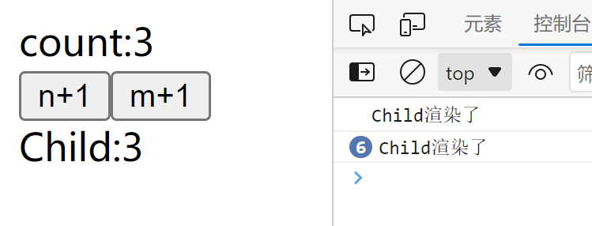

众所周知，在React中，父组件渲染往往会带动着子组件一起渲染，那么随着项目的的增大，许多子组件在自身依赖没有变化的时候不需要进行渲染，如果都进行渲染就会造成性能的下降。那么在React中也存在着一些能够缓存组件以及函数的方式，来提高总体的性能。  
# 使用React.memo来缓存组件
在讲解useMemo之前，需要先了解React.memo，memo是React中缓存组件的一种方式，被缓存的组件memo会根据其props的改变才会去渲染该组件，当props没有进行改变，那么就不对其进行渲染。   
为了更好的说明，我们先创立一个不被缓存的组件  
```javascript
const Memo = () => {
  const [n, setN] = useState(0);
  const onClickN = () => {
    setN((i) => i + 1);
  };
  return (
    <div>
      <div>count:{n}</div>
      <button onClick={onClickN}>n+1</button>
      <Child/>
    </div>
  );
};
const Child =() => {
  console.log("Child渲染了");   //当组件渲染的时候就会打印
  return <div>Child</div>;
};
```
结果是显而易见的，当父组件中的n改变，子组件也会随着父组件一起渲染。  
这时候我们使用React.memo来缓存子组件，并且添加了一个m的状态以显示区别  
```javascript
const Memo = () => {
  const [n, setN] = useState(0);
  const [m, setM] = useState(0);
  const onClickN = () => {
    setN((i) => i + 1);
  };
  const onClickM = () => {
    setM((i) => i + 1);
  };
  return (
    <div>
      <div>count:{n}</div>
      <button onClick={onClickN}>n+1</button>
      <button onClick={onClickM}>m+1</button>
      <Child data={m}/>
    </div>
  );
};
const Child = React.memo((props) => {
  console.log("Child渲染了");
  return <div>Child:{props.data}</div>;
});
```
  
如图所示，Child组件被成功的缓存了，这里值得注意的是React.memo可以不需要放在函数式组件内部，而可以脱离函数式组件使用（也应该这么设计）。   
但是这里就会出现一个问题，如果传入的props是一个函数，那么这个memo就没有用了。  
这里我传递了一个空函数作为props给子组件，在m和函数主体不变的情况下，子组件还是渲染了，原因是，在执行setN的时候父组件整个组件也重新执行了一遍，执行完后，这个空函数test也重新生成了一遍（函数地址变化了），导致了React.memo的依赖检测到了函数地址变化了，也就导致了子组件重新渲染。  
```javascript
const Memo = () => {
  const [n, setN] = useState(0);
  const [m, setM] = useState(0);
  const onClickN = () => {
    setN((i) => i + 1);
  };
  const onClickM = () => {
    setM((i) => i + 1);
  };
  const test = () => {};
  return (
    <div>
      <div>count:{n}</div>
      <button onClick={onClickN}>n+1</button>
      <button onClick={onClickM}>m+1</button>
      <Child data={m} onClick={test} />
    </div>
  );
};
const Child = React.memo((props) => {
  console.log("Child渲染了");
  return <div onClick={props.onClick}>Child:{props.data}</div>;
});
``` 
  
那么有没有一种方法能让组件中的函数能够缓存呢？  
这时候就需要用到useMemo和useCallback了  
# useMemo与useCallback
useMemo(),接受两个参数，第一个参数是所接受的需要缓存的东西，第二个参数是执行的依赖，只有当依赖改变，第一个参数中的缓存才会被重新计算  
useCallback()接受的参数和描述内容与useMemo几乎相同，但是区别在于，他们的第一个参数往往都是一个回调函数，useMemo它的返回值，是自己第一个参数的return的值；而useCallback的返回值，是他的第一个参数。  
**简单的说，useMemo缓存第一个参数的返回值，useCallback缓存第一个参数。**  
比如说：  
```javascript
const memo = useMemo(          //返回undefined
  ()=>{
    return console.log('1')
  }
,[dep])

const callback = useCallback(  //返回()=>{ return console.log('1') }
  ()=>{
    return console.log('1')
  }
,[dep])
```
在上面的例子中先使用useMemo()
## useMemo
这里我使用了useMemo，返回了一个console.log(n)，只有当m变化的时候，useMemo才会重新计算return的值，当重新计算的时候，就会去执行console.log，控制台就会直接打印出n的数值  
```javascript
const Memo = () => {
  const [n, setN] = useState(0);
  const [m, setM] = useState(0);
  const onClickN = () => {
    setN((i) => i + 1);
  };
  const onClickM = () => {
    setM((i) => i + 1);
  };
  const memoClick = useMemo(() => {
    return console.log(n);
  }, [m]);
  return (
    <div>
      <div>count:{n}</div>
      <button onClick={onClickN}>n+1</button>
      <button onClick={onClickM}>m+1</button>
      <Child data={m} onClick={memoClick} />
    </div>
  );
};
const Child = React.memo((props) => {
  console.log("Child渲染了");
  return <div onClick={props.onClick}>Child:{props.data}</div>;
});
```
  
这里还突然发现一点，如果子组件只有一个onClick的依赖，即使返回值每次都是undefined，组件还是会进行渲染，可能是useMemo的返回值并不是单纯的一个数值，而是return后面跟着的表达式，如果表达式变化了，就代表useMemo变化了。  
## useCallback
同理使用useCallback的话，如果采用同一种写法，那么useCallback就是返回一个函数  
子组件中打印出的就是一个箭头函数，并不会像useMemo一样直接使用return后的值。  
```javascript
const Memo = () => {
  const [n, setN] = useState(0);
  const [m, setM] = useState(0);
  const onClickN = () => {
    setN((i) => i + 1);
  };
  const onClickM = () => {
    setM((i) => i + 1);
  };
  const callbackClick = useCallback(() => console.log(n), [m]);
  return (
    <div>
      <div>count:{n}</div>
      <button onClick={onClickN}>n+1</button>
      <button onClick={onClickM}>m+1</button>
      <Child data={m} onClick={callbackClick} />
    </div>
  );
};
const Child = React.memo((props) => {
  console.log("Child渲染了");
  console.log(`onClick:${props.onClick}`);
  return <div onClick={props.onClick}>Child:{props.data}</div>;
});
```
  
总之，useMemo与useCallback可以用一个公式来描述  
```javascript
useMemo(()=>()=>fn,[dep]) === useCallback(()=>fn,[dep])
```