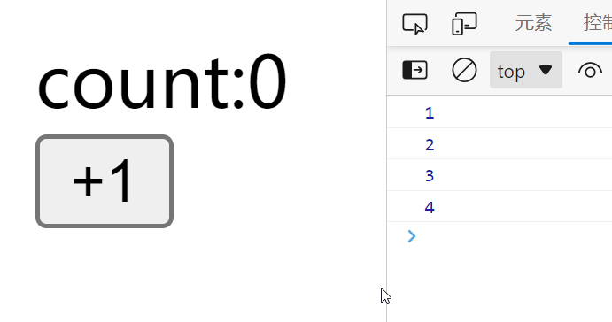
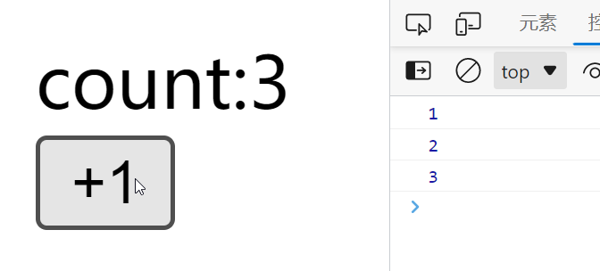
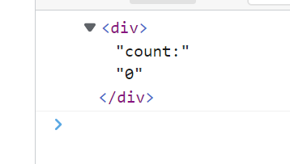
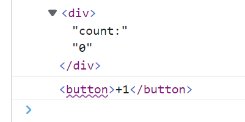
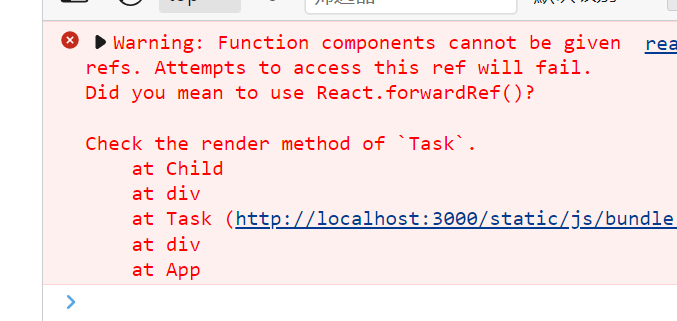
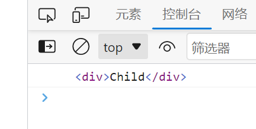
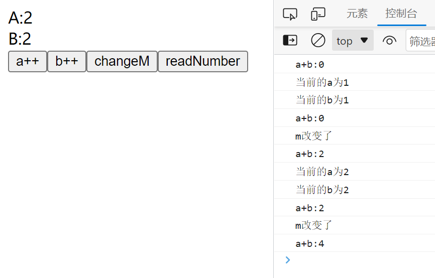

# 使用useRef
useRef可以返回一个可变的ref对象，其.current属性被初始化为传入的参数。返回的ref对象在组件的整个生命周期内持续存在。这是useRef的官方定义。    
我们可以使用ref存储一个数值，布尔，甚至是页面上的DOM对象。并且使用它的.current属性就可以对这个数值进行修改  
```javascript
const number = useRef(0)
const boolean = useRef(true)

number.current = 1              //对ref保存的数值进行修改
boolean.current = false
```
如果保存的是一个数值，那么需要注意的是，使用useRef并不会更新UI，但是useRef的值确实是在变化的。  
下面有一个例子，下面使用了useRef来存放一个数值，使用click使这个值+1，同时打印出当前的ref值。  
下面就会发现，ref值已经变化，但是页面的UI还是不会自动更新。  
```javascript 
const Task = () => {
  const count = useRef(0);
  const onClick = () => {
    count.current += 1;
    console.log(count.current);
  };
  return (
    <div>
      <div>count:{count.current}</div>
      <button onClick={onClick}>+1</button>
    </div>
  );
};
```
  
如果想让UI更新，就得使用useState，state状态发生改变，UI就会自动更新  
下面就使用了一个useState，并且每次点击就改变state状态，于是UI也随之更新。  
```javascript
const Task = () => {
  const count = useRef(0);
  const [x, setX] = useState(0);
  const onClick = () => {
    setX(Math.random());
    count.current += 1;
    console.log(count.current);
  };
  return (
    <div>
      <div>count:{count.current}</div>
      <button onClick={onClick}>+1</button>
    </div>
  );
};
```
  
useRef还可以引用当前组件的一个标签  
```javascript
const Task = () => {
  const count = useRef(0);
  const dom = useRef(null);         //使用一个useRef来保存
  useEffect(() => {
    console.log(dom.current);
  }, []);
  return (
    <div>
      <div ref={dom}>count:{count.current}</div>   //被引用的DOM
      <button>+1</button>
    </div>
  );
};
```

这里的ref引用的dom也可以作为函数，useCallback的第一个参数使用  
```javascript
const Task = () => {
  const count = useRef(0);
  const dom = (ll) => {
    console.log(ll);
  };
  const callbackDom = useCallback((n) => {
    console.log(n);
  }, []);
....
  return (
    <div>
      <div ref={dom}>count:{count.current}</div>
      <button ref={callbackDom} onClick={onClick}>
        +1
      </button>
    </div>
  );
};
```
  
但是使用**ref不能够引用到函数式组件**，这时候控制台就会报错，就需要叫你使用React.forwardRef()  
```javascript
const Task = () => {
  const refDom = useRef(null);
  return (
    <div>
      <Child ref={refDom} />
    </div>
  );
};
const Child = () => {
  return <div>Child</div>;
};
```
  
# 使用React.forwardRef  
React.forwardRef 会创建一个React组件，这个组件能够将其接受的 ref 属性转发到其组件树下的另一个组件中。这是官方给出的定义，也就是说，forwardRef的作用就是转发ref。  
被forwardRef包裹住的组件会在函数参数中多出一个ref参数，用于引用自身的dom节点。  
继续使用之前的组件，这时候我们把子组件使用forwardRef包裹起来，再次使用ref来引用子组件，子组件中也使用ref来引用自身的dom，使其转发到父组件中。  
```javascript
const Task = () => {
  const refDom = useRef(null);
  useEffect(() => {
    console.log(refDom.current);
  }, []);
  return (
    <div>
      <Child ref={refDom} />
    </div>
  );
};

const Child = React.forwardRef((props, parentRef) => {
  return <div ref={parentRef}>Child</div>;
});
```

这样就可以引用到函数式组件中的ref了。  
## 与useImperativeHandle配合使用
useImperativeHandle 可以让你在使用 ref 时自定义暴露给父组件的实例值。也就是说，你可以自定义你想要引用的对象。  
这个属性常常和forwardRef一起使用，useImperativeHandle接受三个参数，第一个是你的ref引用的名称，第二个是需要对ref的操作，第三个是依赖，只有当依赖改变的时候，第二个参数中的值才会改变  
下面使用一个简单的示例，通过ref引用子组件的input，并将操作input的focus事件传递给父组件。并且子组件可以使用多个ref来引用多个dom的操作。  
```javascript
const Ref = () => {
  const ref = useRef(null);
  const onFocus1 = () => {
    ref.current.focus1();
  };
  const onFocus2 = () => {
    ref.current.focus2();
  };
  return (
    <>
      <div>
        <div>Title</div>
        <Child ref={ref} />
        <button onClick={onFocus1}>focus1</button>
        <button onClick={onFocus2}>focus2</button>
      </div>
    </>
  );
};

const Child = React.forwardRef((props, ref) => {
  const inputRef = useRef(null);
  const inputRef2 = useRef(null);
  useImperativeHandle(ref, () => ({
    focus1: () => {
      inputRef.current.focus();
    },
    focus2: () => {
      inputRef2.current.focus();
    },
  }));
  return (
    <div>
      <input ref={inputRef} />
      <input ref={inputRef2} />
    </div>
  );
});
```
这里主要说明依赖的问题，只有当依赖改变了，那么useImperativeHandle中的数值才会被重新计算。  
这里的子组件定义了a，b两个值的状态，并且给父组件提供了一个返回ab相加结果的接口，这里再通过一个m来控制依赖状态的改变，我们可以看到，只有当m的状态改变了，父组件中的返回值才是当前正确的ab相加的值  
```javascript
const Task = () => {
  const refDom = useRef(null);
  const readNumber = () => {
    const number = refDom.current.readNumber();
    console.log(`a+b:${number}`);
  };
  return (
    <div>
      <Child ref={refDom} />
      <button onClick={readNumber}>readNumber</button>
    </div>
  );
};
const Child = React.forwardRef((props, parentRef) => {
  const [a, setA] = useState(0);
  const [b, setB] = useState(0);
  const [m, setM] = useState(0);
  useImperativeHandle(
    parentRef,
    () => ({
      readNumber: () => {
        return a + b;
      },
    }),
    [m]
  );
  const addA = () => {
    setA((i) => {
      console.log(`当前的a为${i + 1}`);
      return i + 1;
    });
  };
  const addB = () => {
    setB((i) => {
      console.log(`当前的b为${i + 1}`);
      return i + 1;
    });
  };
  const changeM = () => {
    console.log("m改变了");
    setM((i) => i + 1);
  };
  return (
    <>
      <div>A:{a}</div>
      <div>B:{b}</div>
      <button onClick={addA}>a++</button>
      <button onClick={addB}>b++</button>
      <button onClick={changeM}>changeM</button>
    </>
  );
});
```
