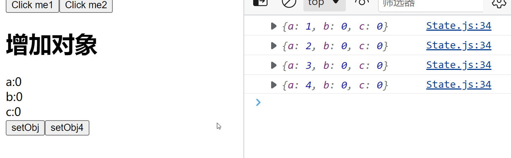

在React的hook中，可能最常用的hook就是useState了，下面就列举了一些使用useState的心得，希望能给大家一些启发。  
# 了解useState
## 创建一个useState
```javascript
const [count, setCount] = useState(0);
const [obj, setObj] = useState({
    a: 0,
    b: 0,
    c: 0,
  });
const [func, setFunc] = useState(() => {
    return () => { console.log("func"); };
  });
const [arr, setArr] = useState([1,2,3,4]);
```
可以对数字，对象，函数，数组，进行状态管理，并且会在左边暴露出两个在组数中的接口，第一个接口用于读取数据，第二个接口用于写数据。
## 使用写数据接口
useState用于管理react中的状态，可以说是各种数据，一般情况下有两种使用方式，下面我写了两个按钮，用于将这个count的值+1
```javascript
const State = () => {
  const [count, setCount] = useState(0);
  const onClick1 = () => {
    setCount(count + 1);    //直接调用函数，参数为count+1
  };
  const onClick2 = () => {
    setCount((i) => {
      console.log(i);   //打印出的是改变之前的count值
      return i + 1;     //使用函数来回调
    });
  };
  return (
    <div>
      <p>You clicked {count} times</p>
      <button onClick={onClick1}>Click me1</button>
      <button onClick={onClick2}>Click me2</button>
    </div>
  );
};

export default State;
```
这里的onClick1是直接使用了对当前数据所进行的改变作为值传入setCount函数，进行数据的修改；  
第二种方式是使用一个回调函数，回调函数接受一个参数，这个参数是还未被修改的当前值，然后将需要对当前参数进行的修改作为回调函数的返回值，这样就能够修改count。    
两种方式都有各自的好处，但是这里还是推荐第二种方式来做数据的改变。原因会在下面说明。  
# 使用useState的注意要点
## 要点一：不可局部更新
当我们使用useState来对一个对象进行状态管理时，不可以只对对象中的一个key进行局部更新，必须将整个对象进行更新，才会使状态改变。  
```javascript
const [obj, setObj] = useState({
    a: 0,
    b: 0,
    c: 0,
  });

const onClick3 = () => {
    setObj({ a: obj.a + 1 });    //这样是不行的
  };
```
如果只对其中的一项进行更新，那么会让没有被选中的其他key的值直接消失，如下图所示  
  
我们可以使用扩展符来实现整个对象的更新  
```javascript
const onClick4 = () => {
    setObj( { ...obj, a: obj.a + 1 } );
  };
```
这样就可以实现整个对象的更新，并且不会丢失其他的数据了  

## 要点2：对象的地址需要改变
我们可以发现，useState不是有一个读接口，那么直接通过读接口将状态改变，不就可以直接改数据了？
```javascript
const onClick4 = () => {
    obj.a += 1;
    console.log(obj);
  };
```
我们打印出obj发现确实对象的值改变了，但是UI并没有改变  

原因是，react中每次改变对象的状态，需要使用不同地址的数据进行改变，我们如果直接在写接口来改变状态，在react中是不被允许的。  
## 要点3：多次操作useState使用函数式
如果在一个click中，同时使用了两次setState，并且是采用简单模式，就会发生一些神奇的现象
```javascript
const [count, setCount] = useState(0);
const onClick1 = () => {
    setCount(count + 1);
    setCount(count + 1);
  };
```
这里同时使用了两个setCount并且都是讲count+1，我们期望的到的数是2，但是实际上count只加了1  
  
如果我们把第二个setCount变为count+2，那么值又会变成什么呢  
```javascript
  const onClick1 = () => {
    setCount(count + 1);
    setCount(count + 2);
    console.log(count);
  };
```
  
这个函数每次只加了2，出现这个现象的原因是在于useState是一个异步操作，每次setCount的时候都会记录当前的SetCount的值，并对其进行改变。  
也就是说，这两步操作是这样setCount(0+1)、setCount(0+2)所以每次只加了最后一步操作的值，也就是+2。
如何解决这个问题？  
这时候就需要使用函数式，将上式改为函数式就可以完美解决了
```javascript
  const onClick1 = () => {
    setCount((i) => i + 1);
    setCount((i) => i + 2);
    console.log(count);
  };
```
  
这样就可以对State进行多次操作并且符合预期了，这样的函数式在for循环、遍历操作中常常使用。
```javascript
  const onClick1 = () => {
    for (let i = 0; i < 5; i++) {
      setCount((n) => {
        console.log(n);
        return n + 1;
      });
    }
  };
```  
