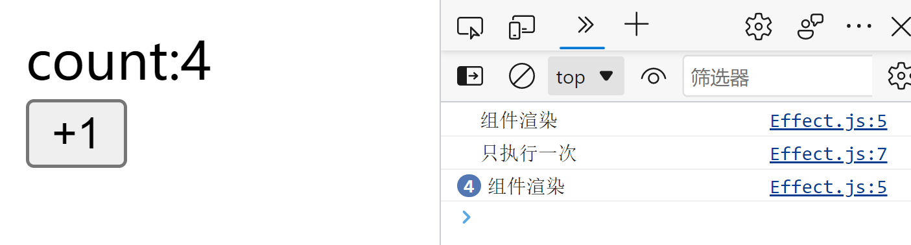
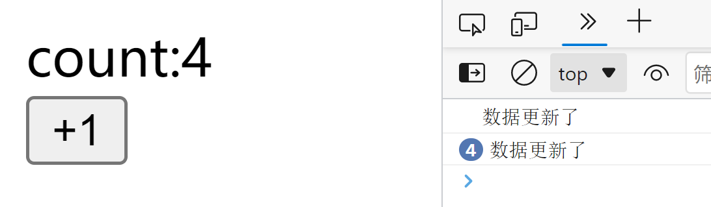
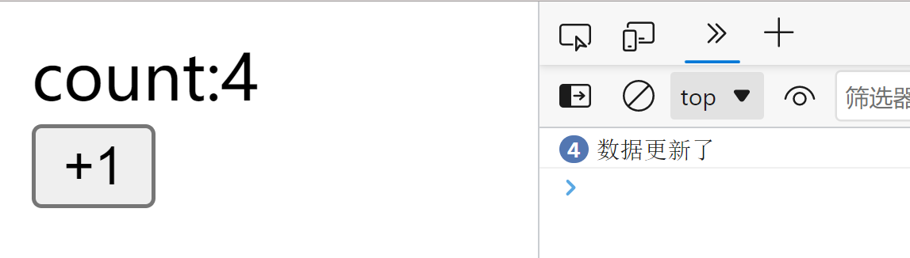
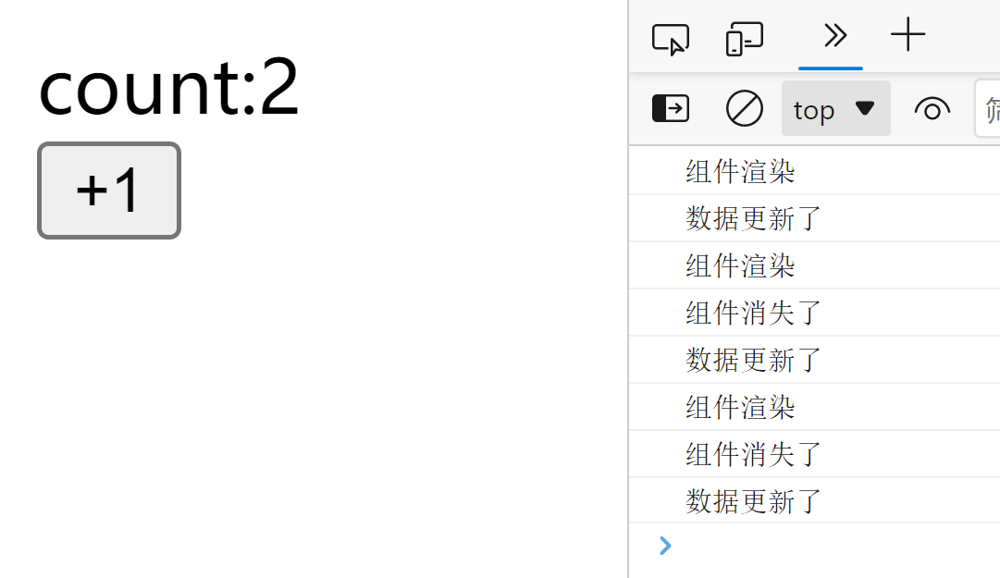
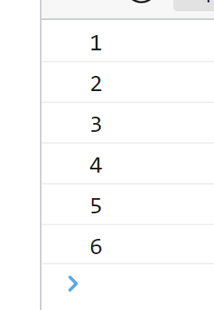
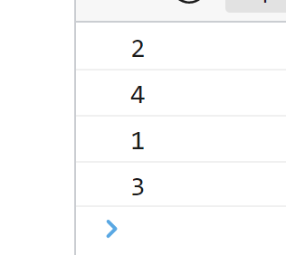
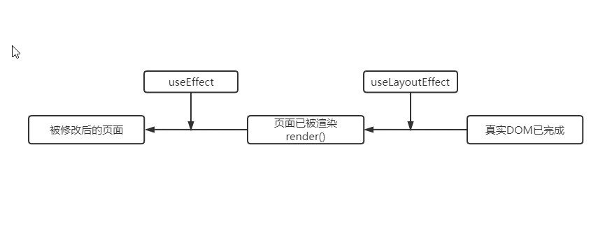

在react中由于函数式组件没有生命周期，因此hook添加了一个useEffect来模拟生命周期的使用。本文介绍了如何使用useEffect来替代生命周期，以及useEffect与useLayoutEffect的区别。  
# useEffect  
## 模拟componentDidMount  
componentDidMount是当组件第一次挂载的时候才执行的函数，使用useEffect可以在依赖这边添加一个空数组，那么这个useEffect就只会在第一次组件挂载的时候才执行了。  
这里我使用了一个计数器，并且使用了useEffect，依赖使用了空数组，当组件每次渲染的时候，会打印出“组件渲染”，但是只有在组件第一次渲染的时候才会打印出“只执行一次”  
```javascript
const Effect = () => {
  const [count, setCount] = useState(0);
  console.log("组件渲染");
  useEffect(() => {
    console.log("只执行一次");
  }, []);
  const onClick = () => {
    setCount((i) => i + 1);
  };
  return (
    <div>
      <div>count:{count}</div>
      <button onClick={onClick}>+1</button>
    </div>
  );
};
```
  
## 模拟componentDidUpdate
componentDidUpdate的作用是在当组件更新时，就会使用这个钩子函数，在useEffect中在依赖数组中添加依赖，就可以实现当依赖的状态改变，useEffect就会执行。    
这里我把count作为依赖添加到了useEffect中，当count的值改变，就会执行一次useEffect。  
```javascript
const [count, setCount] = useState(0);
  useEffect(() => {
    console.log("只执行一次");
  }, [count]);
  const onClick = () => {
    setCount((i) => i + 1);
  };
```
  
但是这里会有一个问题，那就是第一次组件渲染的时候也会执行useEffect，如果我们需要第一次不进行渲染，那么我们可以使用一个状态来代表第一次，当状态处于第一次渲染的时候useEffect就不进行更新。  
这里使用了useRef来标记状态，当first的值为true时，useEffect就不进行更新，并且将first的值改变，之后的每次更新，就可以正常使用useEffect了。  
```javascript
const [count, setCount] = useState(0);
  const first = useRef(true);
  //   console.log("组件渲染");
  useEffect(() => {
    if (first.current) {
      first.current = false;
      return;
    }
    console.log("数据更新了");
  }, [count]);
  const onClick = () => {
    setCount((i) => i + 1);
  };
```

## 模拟componentWillUnmount
componentWillUnmount是在组件取消挂载的时候才会执行的生命周期钩子，在useEffect中使用return，就可以在这个组件消失的时候执行return后面的函数。  
当我们每次改变视图，就会伴随着一次组件的渲染和消失，因此也会触发return后的回调函数  

```javascript
const [count, setCount] = useState(0);
  console.log("组件渲染");
  useEffect(() => {
    console.log("数据更新了");
    return () => {
      console.log("组件消失了");
    };
  }, [count]);
  const onClick = () => {
    setCount((i) => i + 1);
  };
```
  
## useEffect具有顺序
useEffect的执行顺序是按每个useEffect在代码中的顺序来执行的，如果其中有异步函数，也会在同步任务执行完后，按顺序执行异步函数  
```javascript
useEffect(() => {
    console.log("1");
    setTimeout(() => {
      console.log("4");
    });
  }, []);
  useEffect(() => {
    console.log("2");
    setTimeout(() => {
      console.log("5");
    });
  }, []);
  useEffect(() => {
    console.log("3");
    setTimeout(() => {
      console.log("6");
    });
  }, []);
```
  
# useEffect与useLayoutEffect的区别
useLayoutEffect与useEffect在用法上基本一致，也是接受两个参数，一个参数是用于执行的回调函数，第二个参数是所接受的依赖。    
但是useLayoutEffect与useEffect最大的区别在于，useLayoutEffect的执行顺序永远在useEffect之前，包括其中的异步函数  
```javascript
useEffect(() => {
    console.log("1");
    setTimeout(() => {
      console.log("3");
    });
  }, []);
  useLayoutEffect(() => {
    console.log("2");
    setTimeout(() => {
      console.log("4");
    });
  }, []);
```
  
这是因为，useLayoutEffect的执行处于render之前，而useEffect的执行处于render之后（如下图所示），因此useLayoutEffect常用于在render之前对真实的DOM执行一些操作，这样等render之后就是一个已经被操作完成的真实DOM，而如果使用useEffect去操作真实DOM，那么就会造成页面的闪动，造成一些不太好的用户体验。  
  
那么，如果把所有的操作都使用useLayoutEffect完成，不使用useEffect，那这样不就好了？  
但是这样就有一个问题，如果吧所有的操作放在useLayoutEffect完成，那么会在render前停留较长的时间，这就会导致用户会更晚的看到被渲染的页面，这实际上更是一种不好的体验，并且，并不是所有的操作都需要对DOM做操作，因此也并不需要全都使用useLayoutEffect。能使用useEffect就尽量使用useEffect。