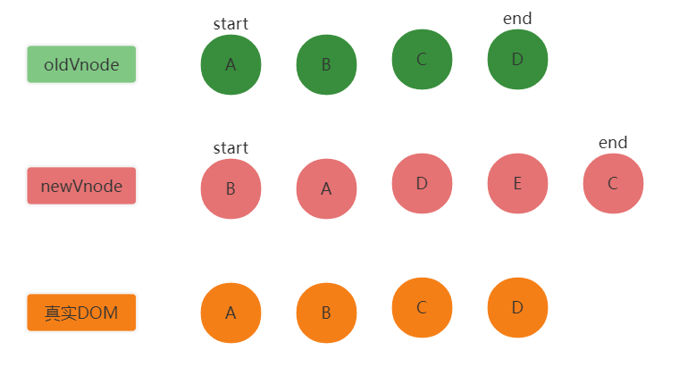

# 什么是diff算法  
diff算法是指用于比较虚拟DOM新旧节点之间的变化，找出新旧节点之间的差异，以达到最小化更新视图，提高渲染性能的一种算法。  
这个算法有两个基本特点：  
1. 比较只会在同层级进行，不会跨层比较。
2. 在diff比较过程中，是从节点的两端向中间比较。  

# diff算法是如何触发的？
1. 当数据变化，就会触发setter，setter会触发Dep.notify来通知订阅者更新视图，也就是触发patch
2. patch接受两个参数，一个是旧节点，一个是新节点
3. 首先，先判断新节点和旧节点是否是同类标签，若不是，就直接替换节点，若是就进行下一步比对
4. 如果节点标签相同，就需要进行patchVnode方法，如果两个节点是相等的，就直接return，如果不相等，就得分情况处理
5. 如果新旧节点的文本节点不同，就用新文本替换旧文本；如果旧节点没有子节点，新节点有子节点，就增加新的子节点，相反就删除旧的子节点；如果新旧都有子节点，就需要判断里面的子节点的差异，需要用到updateChildren方法来专门比对子节点  

  
# updateChildren方法
这就是diff的核心算法。采用的是首尾指针法  
比较的大体流程是这样的  
1. 比对开始会在旧DOM的首尾出现两个指针，这两个指针会同时指向新DOM的首尾元素，也就是说，新DOM的首尾节点各有两个指针指向他们
2. 初始化完后就开始比对，先从旧DOM的首节点开始分别比对新DOM的首尾节点，如果有匹配成功，那么就将旧DOM的自身指针向尾部移动一个节点，再次对新DOM抛出两个指针做比对；如果没有匹配成功，那么在新DOM上的两个指针都分别向中间移动一位，再次比对，直至新DOM的指针都达到同一个位置，比对结束。
3. 每轮比对结束后如果没有找到匹配的节点，旧DOM会向新DOM比较key值，如果key值相同，就可以复用，并移动到新虚拟节点的DOM位置
4. 当旧DOM的首指针转移到尾指针后，或者尾指针转移到首指针前，那么这时候整个的diff就完成了
下面来做个演示  
假如有这样一个新旧虚拟DOM节点，新旧节点的指针都出现在新旧DOM的首尾节点  
  
下面旧节点的A和D将向新节点的B和C做比较，但是都不匹配，于是向新节点的内部再次比对  
  
此时新节点的A匹配上了，于是在真实DOM中A节点被放到了第二位，并开始下一轮循环
  
下一轮循环要从旧DOM的B节点开始，因为A节点已经匹配过了，于是B节点也匹配上了，在真实DOM中把B节点的顺序变为第一位。  
   
开始下一轮匹配，此时旧节点需要从C节点开始，新节点要从D节点开始匹配，于是C节点匹配上了，并在真实DOM中改变了C节点位置  
  
最后旧DOM的指针全在D节点，于是D节点开始匹配，匹配到了新DOM的D节点，并改变D节点位置  
  
此时旧DOM的start指针排在end指针之后，比对结束，新节点的指针还在比对，现在在新DOM中没有被匹配到的节点就会直接按位置产生虚拟DOM  
  
那么这样一个diff算法的流程就结束了