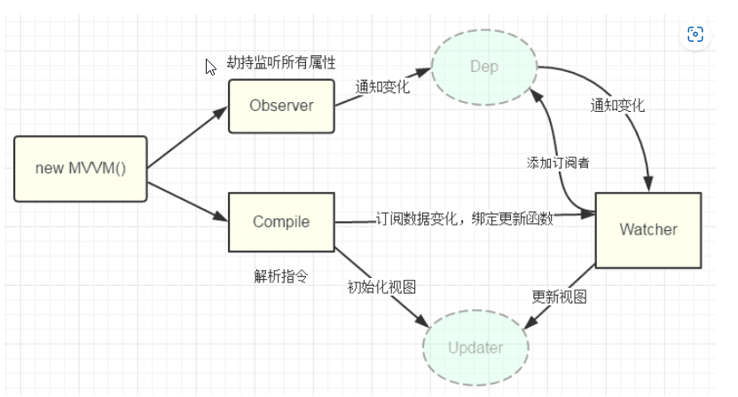

# 简单说法
vue2中的双向绑定一般是使用`v-model`/`.sync`实现的，`v-model`是`v-bind:value`和`v-on:input`的语法糖。
* `v-bind:value`实现了data向UI的单项绑定
* v-on:input实现了UI向data的单项绑定
* 二者结合就是双向绑定了  

这两个单项绑定的原理是：
* 前者通过Object.defineProperty API给data创建getter和setter，用于监听data的改变，data一变就会安排改变UI
* 后者通过编译器给DOM事件添加事件监听，DOM的input值变了就回去修改data

# 简单分析
  
这张图片显示了vue2双向绑定的核心概念，按自己的话说，就是创建一个Vue实例时，会使用Observer来劫持监听所有的属性，其次会用Compile来编译dom节点，在Observer中会使用Dep来对每一个key管理data，在Compile中会初始化视图，如果UI发生变化，Compile会通知Watcher来执行Dep中的更新函数来更新data，并且同时更新 dom视图。  
借用代码来更好的说明这一点：
### 1.创建Vue类和Observer类
```javascript
class Vue {  
  constructor(options) {  
    this.$options = options;  
    this.$data = options.data;  
        
    // 对data选项做响应式处理  
    observe(this.$data);  
        
    // 代理data到vm上  
    proxy(this);  
        
    // 执行编译  
    new Compile(options.el, this);  
  }  
}  

function observe(obj) {  
  if (typeof obj !== "object" || obj == null) {  
    return;  
  }  
  new Observer(obj);  
}  
  
class Observer {  
  constructor(value) {  
    this.value = value;  
    this.walk(value);  
  }  
  walk(obj) {  
    Object.keys(obj).forEach((key) => {  
      defineReactive(obj, key, obj[key]);  
    });  
  }  
}  
```
这里创建了一个Vue的类，并且将data绑定在observe上，并且将挂载的dom节点和实例本身传递给Compile执行编译。  
我们可以看到在observe上，会对每一个节点执行一个函数defineReactive，这个函数能帮助Observer来管理data。
### 编译Compile
```javascript
class Compile {  
  constructor(el, vm) {  
    this.$vm = vm;  
    this.$el = document.querySelector(el);  // 获取dom  
    if (this.$el) {  
      this.compile(this.$el);  
    }  
  }  
  compile(el) {  
    const childNodes = el.childNodes;   
    Array.from(childNodes).forEach((node) => { // 遍历子元素  
      if (this.isElement(node)) {   // 判断是否为节点  
        console.log("编译元素" + node.nodeName);  
      } else if (this.isInterpolation(node)) {  
        console.log("编译插值⽂本" + node.textContent);  // 判断是否为插值文本 {{}}  
      }  
      if (node.childNodes && node.childNodes.length > 0) {  // 判断是否有子元素  
        this.compile(node);  // 对子元素进行递归遍历  
      }  
    });  
  }  
  isElement(node) {  
    return node.nodeType == 1;  
  }  
  isInterpolation(node) {  
    return node.nodeType == 3 && /\{\{(.*)\}\}/.test(node.textContent);  
  }  
}  
```
编译阶段会分析dom节点，会根据dom上绑定的指令绑定相应的更新函数。
### 收集依赖
这个阶段会使用Dep来管理数据，Observer会对每一个key创建一个Dep，在Dep中有两个方法，一个用来添加新的数据，一个用于更新数据
```javascript
// 负责更新视图  
class Watcher {  
  constructor(vm, key, updater) {  
    this.vm = vm  
    this.key = key  
    this.updaterFn = updater  
  
    // 创建实例时，把当前实例指定到Dep.target静态属性上  
    Dep.target = this  
    // 读一下key，触发get  
    vm[key]  
    // 置空  
    Dep.target = null  
  }  
  
  // 未来执行dom更新函数，由dep调用的  
  update() {  
    this.updaterFn.call(this.vm, this.vm[this.key])  
  }  
}  

class Dep {  
  constructor() {  
    this.deps = [];  // 依赖管理  
  }  
  addDep(dep) {  
    this.deps.push(dep);  
  }  
  notify() {   
    this.deps.forEach((dep) => dep.update());  
  }  
}  

function defineReactive(obj, key, val) {  
  this.observe(val);  
  const dep = new Dep();  
  Object.defineProperty(obj, key, {  
    get() {  
      Dep.target && dep.addDep(Dep.target);// Dep.target也就是Watcher实例  
      return val;  
    },  
    set(newVal) {  
      if (newVal === val) return;  
      dep.notify(); // 通知dep执行更新方法  
    },  
  });  
}  
```
当data数据改变，Watcher会立即更新Dep中的数据，并且更新视图。  
本文参考：[点击这里](https://vue3js.cn/interview/vue/bind.html#%E4%BA%8C%E3%80%81%E5%8F%8C%E5%90%91%E7%BB%91%E5%AE%9A%E7%9A%84%E5%8E%9F%E7%90%86%E6%98%AF%E4%BB%80%E4%B9%88)，代码也是这里的。