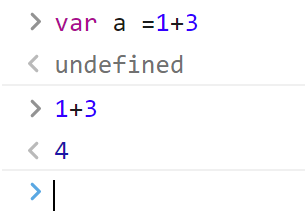
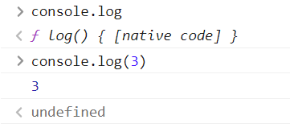

# JavaScript基本语法
最近学习了JavaScript的一些基本语法，做了一些笔记，故写一篇博客来记录。  
本文的主要内容有：  
* 什么是表达式和语句
* 标识符的规则
* if else语句
* while for语句
* break和continue
* label  

## 什么是表达式和语句
先说明什么是语句，语句是为了完成某种任务而进行的操作，比如：  
```javascript
var a = 1;
var a = 1 + 3;
var a = 'abc';
```
上面的都是语句，作用是给a赋值，而其中`1+3`就是它的表达式，指一个为了得到返回值的计算式。那么二者的区别是什么呢？
区别主要有两点：
1. 表达式一般有值，而语句有可能有，也可能没有
2. 语句可能会改变环境  

这里主要说明第一点，举个例子：
```javascript
分别输入
var a = 1 + 3；
和
1 + 3；
结果会是什么？
```
答案如下图所示，var语句输出的是undefined，1+3输出的是4。  
  
在这里需要注意的是：
* 值和返回值是不一样的，1+2表达式的值为3，add(1,2)表达式的值为函数的返回值
* console.log表达式的值为函数本身
* console.log(3)表达式的值为undefined，3只是他打印出来的东西。  

  

还有最后一点：
* javascript运行是一行一行运行的，行与行之间用;隔开，而,不会隔开，逗号在这代表的一句话没完的意思。
* 通常情况下，除了需要断句的空格之外，其他多余的空格基本没用
* 回车也是相同的，但只有一种情况除外，那就是**return的后面**

## 标识符的规则
标识符指的是用来识别各种值的合法名称。最常见的标识符就是变量名，以及函数名。简单的命名规则如下：
* 第一个字符，可以是任意 Unicode 字母（包括英文字母和其他语言的字母），以及美元符号（$）和下划线（_）。
* 第二个字符及后面的字符，除了 Unicode 字母、美元符号和下划线，还可以用数字0-9。
* 中文也是合法的标识符，可以用作变量

下面是不可以做标识符的一些例子：
```
2b  //标识符的第一个字符不能是数字
22  //同上
***  //标识符不能为星号
a+b  //标识符中不能有加号
-c   //标识符中不能有减号或是连线符
```
## if else语句
语法：`if(表达式){语句一}else{语句二}`或者是：  
```javascript
if(表达式一){语句一}
    else if(表达式二){语句二}
    else if(表达式三){语句三}
    else{语句四}
```
做个说明，if else语法是这样的，先判断表达式的值是否为真，如果为真，则执行语句一，若为假，则执行语句二。下面的多次判断语法也是一样的，先判断表达式一，若为真执行语句一，若为假，判断表达式二，以此类推。  
那么就有些特别情况：  
```javascript
a=1
if(a=2){
console.log('a')
}else{
console.log('a等于2')}
1.会打印出什么？

a=2
if(a===2)
console.log('a')
console.log('a等于2')
2.会打印出什么？

a=1
if(a===2)
console.log('a'),console.log('a等于2')
3.会打印出什么？

a=1
if(a===2)
console.log('a');console.log('a等于2')
4.会打印什么
```
那么答案是：
1. 会打印出a，因为上面的a=1会被下面的a=2赋值，故a=2为真，输出a。这里需要注意的是单独一个等于号作用为赋值，三个等于号才是等于。
2. 会打印出a和a等于2，因为a===2为真，if会执行它的下一句，而后面一句是独立出来的，会单独执行，并不在if语句里。
3. 会打印出undefined，因为逗号代表该语句没有结束，会同时执行两个语句，那a===2为假，就不会执行下面的真条件语句
4. 会打印出a等于2，因为顿号代表语句结束，下一个语句不在if条件里  

一点小建议：*使用if语句时尽量采用最不会有歧义的写法，尽量不要省略花括号*。
## while和for语句
while和for都是一个循环，for是while的简洁写法，两种语句的语法如下：  
```javascript
while语法：
while(表达式){语句}

for语法：
for(语句1;表达式2;语句3){
循环体
}
```
while循环会判断表达式的真假，若表达式为真，则会执行花括号里的语句，执行后再次判断表达式的真假，若表达式再次为真，则会继续执行，为假，就会跳出循环。  
for循环的流程如下：  
* 先执行语句1
* 然后判断表达式2
* 如果为真，执行循环体，然后执行语句3
* 如果为假，直接退出循环，执行后面的语句  

这两种循环都有一些需要注意的地方：
```javascript
while（a！==1）{
console.log(a)
  a=a+0.1
}
这个循环有问题吗？
```
这个while循环看起来是没问题的，但是这里牵扯到浮点数的问题，浮点数不精准，不停加入0.1后，永远不会等于一个精准的1，因此，这是一个死循环。
```javascript
for(car i=0;i<5;i++){
console.log(i)
}
循环ing：
0
1
2
3
4

此时i的值是多少？
```
答案为5，因为当i=4跳出循环时，会执行一个i++语句，此时i的值为5，判断i<5时，为假，所以i=5跳出循环，因此此时i的值为5。
## break和continue
break的意思是跳出当前循环，continue的意思是，跳过这次循环，两者的不同举个例子就可以说明。
```javascript
for(var a=0;a<10;a++){
   if(a===5){break;}
    else{console.log(a);}
    }

打印结果：
0
1
2
3
4
```
当a=5的时候执行了break语句，就跳出了当前循环，不执行后面的console.log
```javascript
for(var a=0;a<10;a++){
   if(a===5){continue}
    else{console.log(a);}
}
打印结果：
0
1
2
3
4
6
7
8
9
```
当a等于5时，跳过此次循环，直接执行下次循环。  
需要注意的是，如果有嵌套循环的话，break和continue只能跳过当前离自己最近的循环，不能跳过最外圈的循环。  
但如果结合了label语句就可以做到跳过外圈的循环了。
## label
label指的是标签，语句的前面有标签，相当于跳转到程序的任意位置。  
语法如下：
```javascript
label:
语句
```
label可以用任何标识符代替，标签可以与break和continue配合使用直接跳出到该标签定位的循环。
```javascript
hhh:
for(var i=0;i<6;i++){
  for(var j=0;j<3;j++){
if(i===1&&j===1){
break hhh;
}else{
  console.log('i=' + i + ', j=' + j);
}
}}

打印结果：
i=0, j=0
i=0, j=1
i=0, j=2
i=1, j=0
```
当i和j都等于1时，直接跳出了hhh这个标签的语句循环，而不是内部的小循环，continue也是同理。  
label也可以跳出代码块：
```javascript
foo:{
console.log(1);
  break foo;
  console.log('本行不会输出')；
}
console.log(2);
结果是1  2
```
# 参考文献
本文主要参考了网道的JavaScript语法教程，大家感兴趣也可以去看看：https://wangdoc.com/javascript/basic/grammar.html
