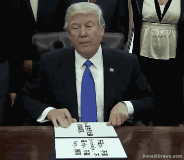

# JavaScript的诞生
最近了解了一些关于JavaScript的历史，做个博客记录一下。
## 始于网景
在1993年，NCSA也就是国家超级电脑应用中心，发表了一个浏览器————NCSA Mosaic，这是一款最早流行的图形接口网页浏览器，这款浏览器对万维网的普及发挥了重要的作用。  
时间来到了1994年，Mosaic的主要开发人员随即创立了网景公司，还雇佣了许多原来NCSA Mosaic的开发人员来开发一款新的浏览器————Netscape Navigator，并且立志要取代Mosaic成为世界第一的浏览器。（*ps：每个创业者都有点中二细胞在的*）  
很快啊，在Netscape Navigator发布的四个月内，就已经占据了浏览器市场的四分之三，并成为了1990年代互联网的主要浏览器。  
这时网景觉得需要有一种语言，让程序员和设计师能够更好地组装图片和插件，且代码可以直接编写在网页标记之中。  
1995年，网景招募了布兰登·艾克，目标是把Scheme语言嵌入到自家的浏览器中。但是在这之前，网景就与昇阳合作，在自家的浏览器中支持Java，这时布兰登的出现，以及把Scheme语言嵌入浏览器的决定，网景内部员工就不开心了，为什么？  
**因为大家都是Java的信徒**   
   

那公司做出了一个决定，准备发明一种与Java代培使用的辅助脚本语言，并且语法上有些类似。正是这一决定，排除了采用现有的语言，例如Perl、Python、Tcl或Scheme。但是为了在其他竞争提案中捍卫JavaScript的想法，公司需要有一个可以用的原型。那么开发的任务就到了谁身上呢？就到了布兰登·艾克的身上。然后布兰登用了十天的时间就把JavaScript设计出来了。  
**难以想象吧，前端三大件之一的JS竟然10天就做出来了**  
  

然后最初的起名叫Mocha，后面又改成了LiveScript，最后公司觉得不行，要和Java蹭一下热度（*ps：当时Java是编程语言中的热词*），所以就临时改名叫做**JavaScript**，这也成为了日后大众对这门语言有诸多误解的原因之一。
## 与微软的竞争
又是1995年，微软推出了IE浏览器，从而引发了与Netscape浏览器的大战。微软对Netscape Navigator解释器进行逆向工程，创建了JScript（*蹭JavaScript的热度*），就与处在领导地位的网景同台竞争。JScript也是一种JavaScript的实现，但是就有一个问题：两个JavaScript语言版本在浏览器端共存说明了语言标准化的缺失。也就导致了有些网页只有在微软或网景浏览器上才能够正常使用。
  
## JavaScript的标准化
在1995年的下一年，1996年的11月，网景正式向ECMA（欧洲计算机制造商协会）提交语言标准。1997年6月，ECMA以JavaScript语言为基础制定了ECMAScript标准规范ECMA-262。JavaScript成为了ECMAScript最著名的实现之一。除此之外，ActionScript和JScript也都是ECMAScript规范的实现语言。尽管JavaScript作为给非程序人员的脚本语言，而非作为给程序人员的脚本语言来推广和宣传，但是JavaScript具有非常丰富的特性。
## 一些后话
### JavaScript的诸多缺陷
由于JavaScript这门语言设计阶段过于仓促，没有先例，以及过早的标准化的原因，导致了这门语言从诞生之初到现在仍有着诸多缺陷。一个著名的前端工程师阮一峰列举了JS的十大缺陷：
1. 不适合开发大型程序
2. 非常小的标准库
3. null和undefined
4. 全局变量难以控制
5. 自动插入行尾分号
6. 加号运算符
7. NaN
8. 数组和对象的区分
9. ==和===
10. 基本类型的包装对象  

具体大家可以去他的博客看看：http://www.ruanyifeng.com/blog/2011/06/10_design_defects_in_javascript.html  
虽然说缺陷诸多，但它仍然是一个编程能力很强大的语言，至少阮一峰认为它的前途还是很乐观的。  

### 浏览器大战后面怎么样了
由于后面微软的IE浏览器直接绑定了Windows，很快就超越了网景浏览器，在1998年，网景陷入了窘境，最后打算搏一搏，将浏览器开源（*ps：我网景就算是死了，我的浏览器也要活着*）。这也是后来的火狐浏览器，最终网景也并没有因为此举动而受到资本的青睐，最后被美国在线AOL收购，网景程序员遭到解雇，布莱登在之后一直协助维护火狐浏览器的运营。  
  

### 布莱登与JavaScript
大家一定觉得：布莱登十天就能做出JavaSCript，那他一定很爱JavaScript这门语言吧。  

实际上，他并不喜欢这门语言。布莱登主要方向和兴趣是函数式编程，网景公司招聘他的目的，是研究将Scheme语言作为网页脚本语言的可能性。他本人也是这样想的，以为进入新公司后，会主要与Scheme语言打交道。  
但是谁知道会让他去开发JavaScript，于是他为了应付公司的安排，只用了10天的时间就把JS给做出来了，由于开发时间过短，在后面很长一段时间内，用JS写出的程序混乱不堪，到今天好很多了。  
直到现在，他还是看不起Java，如果不是公司决策，布莱登肯定不把java作为JS的设计的原型，作为设计者，他一点也不喜欢这个作品。他说：与其说我爱Javascript，不如说我恨它。它是C语言和Self语言一夜情的产物。十八世纪英国文学家约翰逊博士说得好：'它的优秀之处并非原创，它的原创之处并不优秀。'  

## 参考文献
1. https://zh.wikipedia.org/wiki/JavaScript#%E5%8E%86%E5%8F%B2
2. http://www.ruanyifeng.com/blog/2011/06/birth_of_javascript.html
3. http://www.ruanyifeng.com/blog/2011/06/10_design_defects_in_javascript.html
