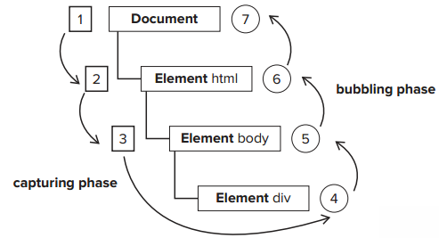
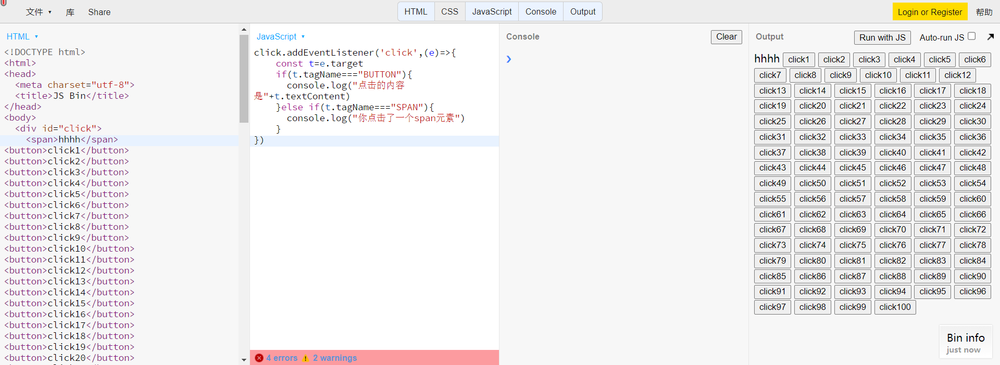
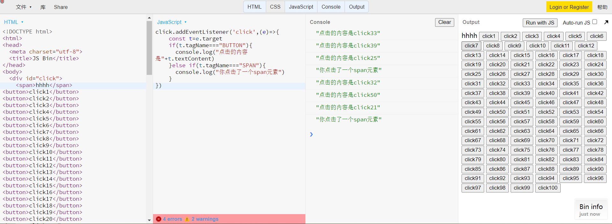
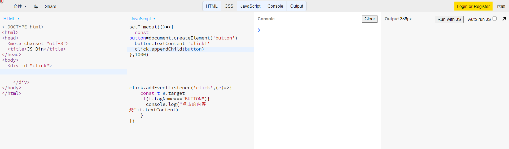

# DOM事件模型和事件委托
本文的主要内容有：
1. 什么是DOM事件模型与DOM事件机制
2. 什么是DOM事件委托
## 什么是DOM事件模型与DOM事件机制
这里有一个例子，看下面的代码：
```html
<div class="爷爷">
    <div class="爸爸">
       <div class="儿子">
        你好
      </div>
    </div>
  </div>
```
有这样的一个结构的div，那么点击了‘你好’两字后，算点击了爷爷，还是爸爸，还是儿子？  
答案是都点击了，那么这时候在三者身上都分别加个函数，那么点击你好，是先调用哪个？  
答案是都调用了，具体是什么顺序得看你用什么样的事件函数。  
那么这时候就有一个dom的事件模型，看下图：  
   
在dom事件的调用中，存在着两种调用方向：  
从祖先元素开始调用，到目标元素停止，这个从外到内依次调用的过程，叫做事件捕获（capturing）。  
从目标元素开始调用，到祖先元素停止，从内到外的过程，叫做事件冒泡（bubbling）。  
DOM事件永远先进行事件捕获，再进行事件冒泡，正如图中所示的顺序，依次调用。  
这样的DOM事件调用的方式，就是DOM事件机制。  
## DOM事件委托
要将清楚这个，必须举两个例子：
例子一：如果现在有一百个button，需要去监听每个button的点击事件怎么办？  
例子二：如果要监听一个现在不存在的元素的点击事件，要怎么办？
第一种事件可以用这样的方式解决：
  
这里我在100个button元素上使用一个div元素将全部的button元素包起来，并且监听了div元素的点击事件，并对点击的元素进行了判断，就可以不用在每个button事件上使用事件绑定API去单独监听了。  
    
第二个例子也可以使用监听祖先元素的方式，来监听button的click事件，代码和效果如下图所示：  
  
  
这里我让一个button在一秒后生成至div内，并监听了div的点击事件。  
像上面两种，不能直接在监听对象上使用事件绑定去直接监听的时候，就需要用到事件委托，所谓事件委托，就是将监听事件绑定在目标元素的祖先对象上，借助祖先元素的力量，来间接的监听事件。
## 补充内容
### 常用的事件绑定API
```javascript
div.attachEvent('onclick',fn) //监听冒泡事件
div.addEventListener('click',fn) //监听捕获事件
div.addEventListener('click',fn,bool) //bool填false或者不填，则是监听冒泡事件；填true是监听捕获事件
```
### 取消冒泡
捕获过程不能取消，但是冒泡过程可以，利用这个API
```javascript
e.stopPropagation()
```
可以中止冒泡过程，使后面的监听冒泡的API失效。  
但有些事件不能被取消冒泡，可以去MDN中查看，Bubbles是该事件是否冒泡，Cancelable是是否可以取消冒泡。  

