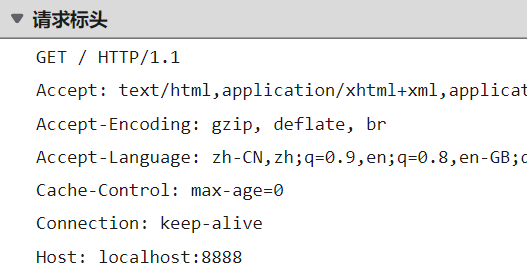
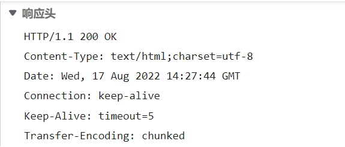
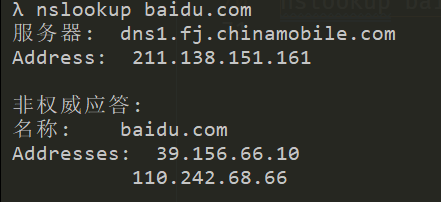

# 浅析URL
这两天学习了有关URL的相关知识，故写一篇博客作为记录。  
本文所包含的内容有：  
1. URL包含哪几个部分，每部分分别有什么作用？
2. DNS的作用是什么，nslookup命令怎么用？
3. IP的作用是什么，ping命令怎么用？
4. 域名是什么，分别哪几类域名？
## URL包含哪几个部分，每个部分分别有什么作用？
URL的全称叫（Uniform Resource Locator），叫统一资源定位符，统一资源定位符是对可以从互联网上得到的资源的位置和访问方法的一种简洁的表示，是互联网上标准资源的地址，大家常用的网址就是URL。  
URL由以下几个部分组成，分别是：  
1. 协议
2. 域名
3. 端口
4. 路径
5. 查询参数
6. 锚点  
下面我们来分别讲述每个部分的作用
### 协议
一般是http或https两种协议，协议的作用是规定客户端与服务器之间的数据传输形式，让客户端与服务端之间能够有效的进行数据沟通。  
一个http包含了请求和响应两个部分，请求是指客户端向服务器索要数据，响应是指服务器返回客户端响应的数据。  
http请求报文包含以下几个部分：
1. 请求行（包括请求动词、路径加查询参数、协议名/版本）
2. 请求头（域名或IP、text/html、请求体的格式）
3. 请求体（上传的内容）  
下面是请求的图片  
  
其中：  
GET/HTTP/1.1就是请求行  
Accept、Host等就是请求头  
GET请求没有请求体。。。  
---
http响应报文包含以下几个部分：
1. 状态行（协议名/版本 状态码 状态字符串）
2. 响应头（响应体的格式）
3. 响应体（下载的内容）
再放张图：  

其中，图中的第一行就是状态行，200就是它的状态码，默认是200。Content-Type就是它的响应体格式。
### 域名
域名就是IP的别称，但是：  
* 一个域名可以对应不同ip（*此方法叫做负载均衡，防止就一台服务器扛不住*）
* 一个ip也可以对应多个域名（*此方法叫做共享主机，穷逼一般用这个*）  
域名可以是一个ip，也可以是类似www.baidu.com的网址（*一般情况下www可以省略，没什么特别大的用处*）
### 端口
每个ip地址有65535个端口，每个端口提供不同的服务，当你访问服务器时，有时要输入端口来保证获取正确的服务。平常我们访问网页时用的端口一般为80或443端口，由于过于常见，所以浏览器地址访问时会自动帮我们添加端口。  
使用端口有几个需要注意的地方：  
* 0-1023号端口是留给系统使用的，只有获得了管理员权限后，才能够使用上面的端口，但不建议使用，可能会出现未知的bug。
* 其他的端口普通用户都可以使用
* 当一个端口已经被使用时，就不能用这个端口使用其他服务。
* 在wiki百科中有不同端口对应的服务，可以自行查询：https://zh.wikipedia.org/wiki/TCP/UDP%E7%AB%AF%E5%8F%A3%E5%88%97%E8%A1%A8#0.E5.88.B01023.E5.8F.B7.E7.AB.AF.E5.8F.A3
### 路径
路径是你想要访问连接的具体位置，是直接加在端口后的，  
比如：/zh-CN/docs/Web/HTML  
在路径最前面的/代表访问的根目录，最后的位置不用加/
### 查询参数
如果需要在同一个页面查询到不同的内容，就需要用到查询参数，大致是这样的，以百度为例，用百度查询hi字符：  
https://www.baidu.com/s?wd=hi  
上面中?wd=hi 就是它的查询参数。
### 锚点
如果要查看同一个内容中的不同位置，就需要加上一个锚点  
如，查看MDN中CSS中的参考书锚点：https://developer.mozilla.org/zh-CN/docs/Web/CSS#%E5%8F%82%E8%80%83%E4%B9%A6  
其中#参考书就是它的锚点，会在页面中自动跳转。但需要注意的是：  
* 锚点不会在浏览器开发者工具中的network面板中看到
* 因为锚点不会传输给服务器
## DNS的作用是什么，nslookup命令怎么用？
DNS的全称是Domain Name Server，也就是域名服务。  
当我们利用浏览器去访问一个域名时，比如访问baidu.com，这时候我们的浏览器并不知道baidu.com所对应的ip地址，这时候就需要向电信/联通等提供网络通讯的厂商所提供的DNS服务器询问baidu.com所对应的ip，知道ip后再通过对应的端口发送请求，才能够正式访问了该网页。  
所以说，DNS的作用是向浏览器提供所要访问域名的ip地址。  
我们也可以使用，**nslookup**命令来查看所要访问域名的ip地址，比如需要访问baidu.com，则在命令行输入：  
nslookup baidu.com  
  
其中，下面的addresses就是百度的ip地址。  
## IP的作用是什么，ping命令怎么用？

